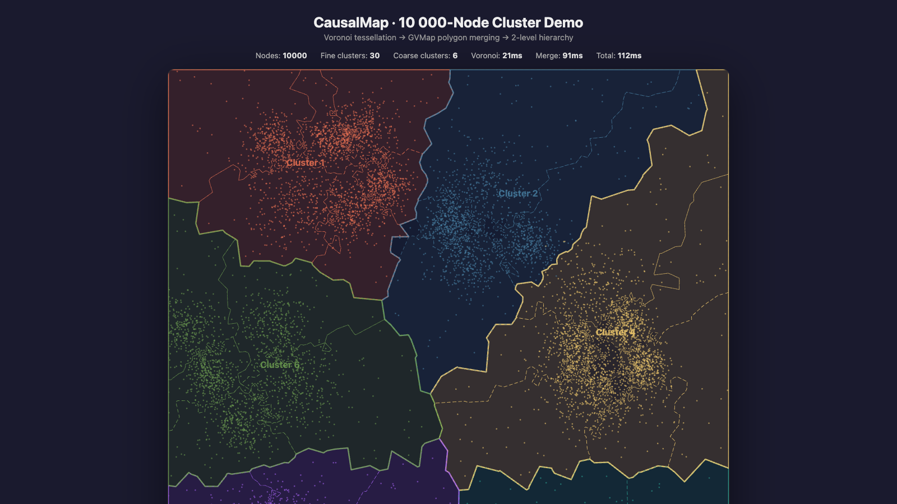

# CausalMap

> Transform hierarchical causal graphs into geographic-map-style SVG visualizations.

**CausalMap** takes a set of timestamped nodes, causal edges, and a multi-level cluster hierarchy, and renders them as a layered map where regions represent clusters and borders show hierarchical nesting — like countries, provinces, and cities on a geographic map.

Key visual encodings from the paper:
- **Color hue** encodes sentiment polarity (orange-red = positive, green = negative, purple = neutral)
- **Color lightness** encodes sentiment degree (darker = stronger sentiment)
- **Cluster forces decay by hierarchy level** — finer clusters attract more strongly than coarser ancestors
- **Edges are hidden by default** — contagion pathways are shown via highlighted region boundaries
- **Sentiment line chart** can be rendered below the map

<p align="center">
  
</p>

## Getting Started

Clone this repository and build:

```bash
git clone https://github.com/renzhongli/CausalMap.git
cd CausalMap
npm install
npm run build
```

### Use in Your Own Project

After building, install the packages locally in your project:

```bash
cd your-project
npm install /path/to/CausalMap/packages/core /path/to/CausalMap/packages/renderer
```

Then import and use:

```ts
import { generateCausalMap } from "@causalmap/core";
import { renderSVG } from "@causalmap/renderer";

const layout = generateCausalMap({
  nodes: [
    { id: "a", timestamp: 1, label: "Topic A", sentiment: "positive", sentimentDegree: 0.8 },
    { id: "b", timestamp: 2, label: "Topic B", sentiment: "negative", sentimentDegree: 0.5 },
    { id: "c", timestamp: 3, label: "Topic C", sentiment: "neutral", sentimentDegree: 0.3 },
  ],
  edges: [
    { source: "a", target: "b", weight: 1 },
    { source: "b", target: "c", weight: 0.8 },
  ],
  clusters: [
    [["a", "b"], ["c"]],       // fine level
    [["a", "b", "c"]],         // coarse level
  ],
}, { width: 1200, height: 700, seed: 42 });

document.getElementById("app").innerHTML = renderSVG(layout, {
  background: "#f7f1e8",
  regionOpacity: 0.72,
  showNodes: true,
  showEdges: false,
  showLabels: true,
  showLineChart: true,
  highlightedPathway: ["L0-C0", "L0-C1"],  // optional: highlight contagion pathway
});
```

## Live Demo

```bash
npm run dev        # → http://localhost:5174
```

Two demos are included:

| Demo | Nodes | Description |
|------|-------|--------------|
| Dense Network | 200 | Full pipeline: 10 groups, 3 hierarchy levels, force layout → Voronoi → GVMap merge |
| 10K Cluster | 10,000 | 2-level spatial clustering with dashed (fine) / solid (coarse) region borders |

The main page (`/`) renders the 200-node causal graph via the full pipeline.  
The cluster page (`/cluster.html`) renders 10,000 pre-positioned points with custom SVG.

## How It Works

The pipeline has five stages:

```
Input Graph → Force Layout → Voronoi Partition → GVMap Merge → Hierarchical Map → SVG Render
```

1. **Force-directed layout** — Nodes are placed along the X-axis by timestamp, then a force simulation spreads them on the Y-axis while keeping clusters cohesive. Cluster attraction forces decay by hierarchy level (strength ∝ 1/(level+1)), so finer-grained clusters pull more strongly.
2. **Voronoi tessellation** — Each node gets a convex cell. Random boundary points outside the viewport ensure clean edge cells.
3. **GVMap polygon merging** — For each cluster, the individual Voronoi cells are merged by removing shared internal edges and tracing the outer boundary loop.
4. **Hierarchical assembly** — Merged polygons are built for every hierarchy level (finest → coarsest), then nested as parent-child regions.
5. **SVG rendering** — Regions are colored by sentiment (hue) and sentiment degree (lightness). Optional pathway highlighting and sentiment line chart.

## Packages

This is a monorepo with npm workspaces:

```
packages/
  core/       → @causalmap/core      Layout, Voronoi, polygon merging, hierarchy
  renderer/   → @causalmap/renderer   SVG generation from MapLayout
examples/
  basic/      → Two demos: Dense Network (200 nodes) & 10K Cluster
```

### `@causalmap/core`

The full pipeline (see above), or lower-level API for custom pipelines:

```ts
import {
  computeNodeLayout,
  generateVoronoiCells,
  buildRegionsByLevel,
  mergePolygons,
  polygonArea,
  polygonCentroid,
  validateGraph,
} from "@causalmap/core";
```

### `@causalmap/renderer`

```ts
import { renderSVG } from "@causalmap/renderer";

const svgString = renderSVG(layout, {
  background: "#f7f1e8",
  regionOpacity: 0.72,
  showNodes: true,
  showEdges: false,          // edges hidden by default (paper design)
  showLabels: true,
  showLineChart: true,       // sentiment line chart below the map
  highlightedPathway: [],    // region IDs to highlight as contagion pathway
  palette: {
    positive: "#e76f51",     // orange-red (paper default)
    negative: "#6a994e",     // green (paper default)
    neutral: "#7b6d8d",      // purple (paper default)
  },
});
```

## API Reference

### Types

```ts
interface CausalNode {
  id: string;
  timestamp: number;
  label?: string;
  sentiment?: "positive" | "negative" | "neutral";
  sentimentDegree?: number;  // [0, 1] — controls color lightness (darker = higher)
}

interface CausalEdge {
  source: string;
  target: string;
  weight?: number;
}

interface HierarchicalGraph {
  nodes: CausalNode[];
  edges: CausalEdge[];
  clusters: string[][][];  // clusters[level][cluster] = nodeId[]
}

interface LayoutOptions {
  width?: number;       // default: 1200
  height?: number;      // default: 800
  padding?: number;     // default: 60
  seed?: number;        // default: 42
  randomPointCount?: number; // Voronoi boundary points (default: 300)
  ticks?: number;       // force simulation iterations (default: 200)
  forces?: {
    repulsion?: number;
    edgeAttraction?: number;
    clusterAttraction?: number;
  };
}
```

### Functions

| Function | Description |
|----------|-------------|
| `generateCausalMap(graph, options?)` | Full pipeline → `MapLayout` |
| `validateGraph(graph)` | Input validation → `{ valid, errors[] }` |
| `computeNodeLayout(graph, options?)` | Force-directed positions only |
| `generateVoronoiCells(positions, options?)` | Voronoi tessellation |
| `buildRegionsByLevel(clusters, cells, nodes)` | Polygon merging + hierarchy |
| `mergePolygons(polygons)` | Merge multiple polygons by removing shared edges |
| `renderSVG(layout, renderOptions?)` | Generate SVG string |

## Scripts

```bash
npm install          # install all workspaces
npm run build        # build core + renderer + example
npm run dev          # start Vite dev server (examples/basic)
npm test             # run all tests (79 tests)
npm run check        # type-check all packages
```

## Citation

If you use CausalMap in your research, please cite our paper:

```bibtex
@ARTICLE{causalMap,
  author={Li, Renzhong and Ye, Shuainan and Lin, Yuchen and Zhou, Buwei and Kang, Zhining and Peng, Tai-Quan and Fu, Wenhao and Tang, Tan and Wu, Yingcai},
  journal={IEEE Transactions on Visualization and Computer Graphics}, 
  title={Causality-based Visual Analytics of Sentiment Contagion in Social Media Topics}, 
  year={2026},
  volume={32},
  number={1},
  pages={35-45},
  doi={10.1109/TVCG.2025.3633839}}
```

## License

MIT